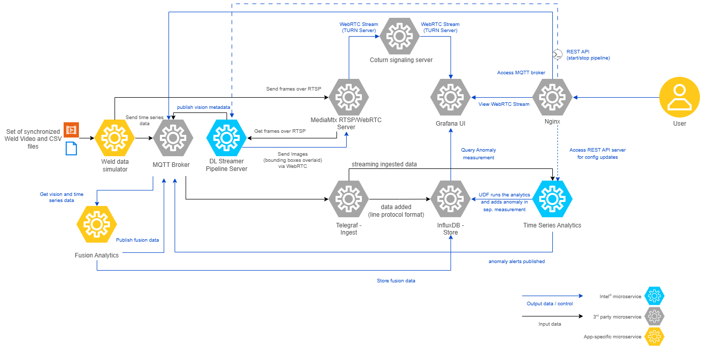

# Architecture

As seen in the following architecture diagram, the sample app at a high-level comprises of data simulators(can act as data destinations if configured) - these in the real world would be the physical devices, the generic Time Series AI stack based on **TICK Stack** comprising of Telegraf, InfluxDB, Time Series Analytics microservice using Kapacitor and Grafana. The Model Registry microservice helps to achieve the MLOps flow by uploading the **UDF deployment package**(comprises of UDF, TICKScripts, models).

## 1. **Data Simulators/Destinations**:
  There are two data simulators - OPC-UA server and MQTT Publisher which read the data from
  the CSV file and writes the data to the OPC-UA and MQTT input plugins in Telegraf.
  The OPC-UA server and the MQTT broker can act as data destinations for receiving the alerts respectively

---

## 2. **Generic Time Series AI stack**

**Key Features**:

- Offers a complete pipeline for data ingestion, storage, processing, and visualization.
- Fully customizable to enable or disable specific services/containers (example, **InfluxDB** can be excluded if data storage is not required).
- Supports integration with alternative time series databases, allowing flexibility beyond **InfluxDB**.
- Extensible **Time Series Analytics Microservice** capable of running Deep Learning models by updating its container image, in addition to Machine Learning models accelerated by Intel® Extension for Scikit-learn*.
- Enables users to ingest their own data via **Telegraf** and implement custom User-Defined Functions (UDFs) in the **Time Series Analytics Microservice** to address specific time series use cases.

### 2.1 **Data Ingestion**

**Telegraf** is a plugin-driven server agent that collects and reports metrics from various sources. It uses input plugins to ingest data and sends it to **InfluxDB** for storage.

- **Supported Input Plugins**: The stack supports multiple input plugins. We have primarily tested the **OPC-UA** and **MQTT** plugins with our **OPC-UA** server and **MQTT** Publisher containers respectively.

- **Documentation**: Refer to the [Telegraf Documentation](https://docs.influxdata.com/telegraf/v1/) for more details.

---

### 2.2. **Data Storage**

**InfluxDB** is a high-performance time series database designed to handle large volumes of write and query operations. It stores both raw ingested data and processed data, which can be organized into different measurements (tables).

- **Key Features**:
  - Optimized for time series data.
  - Supports high write throughput and efficient querying.
- **Documentation**: Refer to the [InfluxDB Documentation](https://docs.influxdata.com/influxdb/v1/) for more details.

---

### 2.3. **Data Processing**

**Time Series Analytics Microservice** uses **Kapacitor** - a real-time data processing engine that enables users to analyze time series data. It supports both streaming and batch processing and integrates seamlessly with **InfluxDB**.
Time Series Analytics Microservice has the Intel® Extension for Scikit-learn* python package which when used in the User Defined Functions (UDFs) of Kapacitor would improve the performance of the Machine Learning algorithms.

- **Custom Logic with UDFs**:
  - Users can write custom processing logic, known as **User-Defined Functions (UDFs)**, in Python.
  - UDFs follow specific API standards, allowing **Kapacitor** to call them at runtime.
  - Processed data is stored back in **InfluxDB** by default.
- **Use Case**: Detect anomalies, trigger alerts, and perform advanced analytics.
- **Documentation**: Refer to the [Kapacitor Anomaly Detection Guide](https://docs.influxdata.com/kapacitor/v1/guides/anomaly_detection/) for details on writing UDFs.

The Time Series Analytics microservice allows customization by reading the UDF deployment package consisting of the UDF scripts, models and TICKScripts from the Model Registry microservice.

---

### 2.4. **Data Visualization**

**Grafana** provides an intuitive user interface for visualizing time series data stored in **InfluxDB**. It allows users to create custom dashboards and monitor key metrics in real time.

- **Key Features**:
  - Connects seamlessly with **InfluxDB**.
  - Supports advanced visualization options.
- **Documentation**:
  - [Getting Started with Grafana and InfluxDB](https://grafana.com/docs/grafana/latest/getting-started/get-started-grafana-influxdb/)
  - [Grafana Documentation](https://grafana.com/docs/grafana/latest/)

---

## Summary

This section provides an overview of the architecture for the Wind Turbine Anomaly Detection sample app. For detailed instructions on getting started, refer to [Get Started](./get-started.md).
