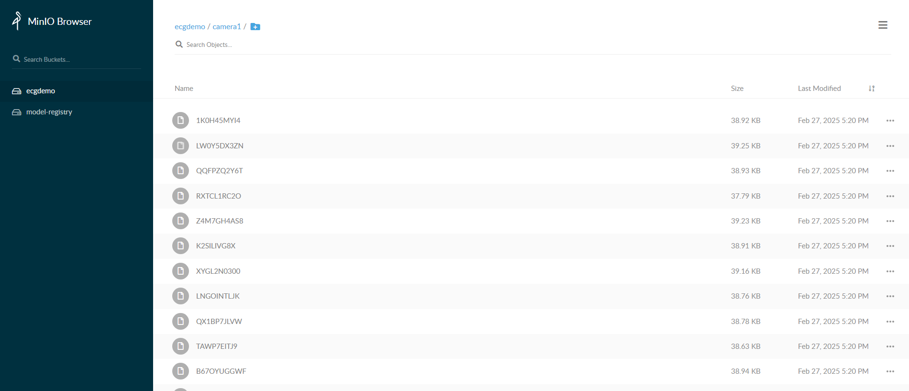

# Storing frames to S3 storage

Applications can take advantage of S3 publish feature from DLStreamer Pipeline Server and use it to save frames to an S3 compatible storage.

## Steps

> **Note** For the purpose of this demonstration, we'll be using MinIO as the S3 storage. The necessary compose configuration for MinIO microservice is already part of the docker compose file.

1. Setup the application to use the docker based deployment following this [document](./get-started.md#setup-the-application).

2. Bring up the containers.
    ```sh
    docker compose up -d
    ```

3. Install the package `boto3` in your python environment if not installed.
    
    It is recommended to create a virtual environment and install it there. You can run the following commands to add the necessary dependencies as well as create and activate the environment.
        
    ```sh
    sudo apt update && \
    sudo apt install -y python3 python3-pip python3-venv
    ```
    ```sh 
    python3 -m venv venv && \
    source venv/bin/activate
    ```

    Once the environment is ready, install `boto3` with the following command
    ```sh
    pip3 install --upgrade pip && \
    pip3 install boto3==1.36.17
    ```
    > **Note** DLStreamer Pipeline Server expects the bucket to be already present in the database. The next step will help you create one.

4. Create a S3 bucket using the following script. 

    Update the `HOST_IP` and credentials with that of the running MinIO server. Name the file as `create_bucket.py`.

   ```python
   import boto3
   url = "http://<HOST_IP>:8000"
   user = "<value of MR_MINIO_ACCESS_KEY used in .env>"
   password = "<value of MR_MINIO_SECRET_KEY used in .env>"
   bucket_name = "ecgdemo"

   client= boto3.client(
               "s3",
               endpoint_url=url,
               aws_access_key_id=user,
               aws_secret_access_key=password
   )
   client.create_bucket(Bucket=bucket_name)
   buckets = client.list_buckets()
   print("Buckets:", [b["Name"] for b in buckets.get("Buckets", [])])
   ```

   Run the above script to create the bucket.
   ```sh
   python3 create_bucket.py
   ```

5. Start the pipeline with the following cURL command  with `<HOST_IP>` set to system IP. Ensure to give the correct path to the model as seen below. This example starts an AI pipeline.

    ```sh
    curl -k https://<HOST_IP>/api/pipelines/user_defined_pipelines/pcb_anomaly_detection_s3write -X POST -H 'Content-Type: application/json' -d '{
        "source": {
            "uri": "file:///home/pipeline-server/resources/videos/anomalib_pcb_test.avi",
            "type": "uri"
        },
        "destination": {
            "frame": {
                "type": "webrtc",
                "peer-id": "anomaly_s3"
            }
        },
        "parameters": {
            "classification-properties": {
                "model": "/home/pipeline-server/resources/models/pcb-anomaly-detection/deployment/Anomaly classification/model/model.xml",
                "device": "CPU"
            }
        }
    }'
    ```

6. Go to MinIO console on `https://<HOST_IP>/minio` and login with `MR_MINIO_ACCESS_KEY` and `MR_MINIO_SECRET_KEY` provided in `.env` file. After logging into console, you can go to `ecgdemo` bucket and check the frames stored.

   
