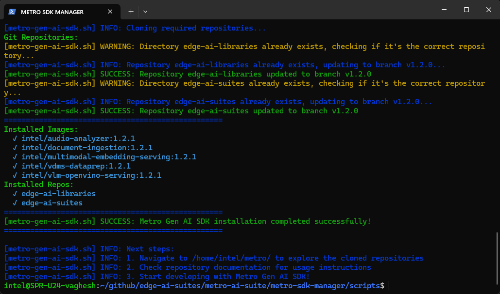

# Getting Started Guide

## Overview

The Metro Gen AI SDK provides a comprehensive development environment for generative AI applications using Intel's optimized tools and microservices. This guide demonstrates the installation process and provides a practical question-answering implementation using retrieval-augmented generation (RAG) capabilities.

## Learning Objectives

Upon completion of this guide, you will be able to:
- Install and configure the Metro Gen AI SDK
- Deploy generative AI microservices for document processing and question-answering
- Understand the architecture of RAG-based applications using Intel's AI frameworks

## System Requirements

Verify that your development environment meets the following specifications:

- Operating System: Ubuntu 24.04 LTS or Ubuntu 22.04 LTS
- Memory: Minimum 64GB RAM (recommended for LLM operations)
- Storage: 100GB available disk space for models and data
- Network: Active internet connection for package downloads

## Installation Process

Execute the automated installation script to configure the complete development environment:

```bash
curl https://raw.githubusercontent.com/open-edge-platform/edge-ai-suites/refs/heads/main/metro-ai-suite/metro-sdk-manager/scripts/metro-gen-ai-sdk.sh | bash
```




## Question-Answering Application Implementation

This section demonstrates a complete RAG (Retrieval-Augmented Generation) application workflow using the installed Gen AI components.

### Step 1: Navigate to Sample Application

Navigate to the pre-installed question-answering application directory:

```bash
cd $HOME/metro/edge-ai-libraries/sample-applications/chat-question-and-answer
```

### Step 2: Configure Environment and Dependencies

Set up the Python virtual environment and install required dependencies:

```bash
# Create and activate virtual environment
python3 -m venv .venv
source .venv/bin/activate
pip install -r ovms_config/requirements.txt

# Install required tokenizer package
pip install openvino-tokenizers transformers jinja2

# Configure application environment variables
export REGISTRY="intel/"
export TAG=1.2.2
source setup.sh llm=OVMS embed=OVMS
```

### Step 3: Deploy the Application

Start the complete Gen AI application stack using Docker Compose:

```bash
docker compose up
```
### Step 4: Verify Deployment Status

Check that all application components are running correctly:

```bash
docker ps
```


### Step 5: Access the Application Interface

Open a web browser and navigate to the application dashboard:

```bash
http://localhost:8101
```

## Additional Resources

### Technical Documentation
- [Audio Analyzer](https://docs.openedgeplatform.intel.com/dev/edge-ai-libraries/audio-analyzer/index.html) - Comprehensive documentation for multimodal audio processing capabilities
- [Document Ingestion - pgvector](https://github.com/open-edge-platform/edge-ai-libraries/blob/main/microservices/document-ingestion/pgvector/docs/get-started.md) - Vector database integration and document processing workflows
- [Multimodal Embedding Serving](https://github.com/open-edge-platform/edge-ai-libraries/blob/main/microservices/multimodal-embedding-serving/docs/user-guide/Overview.md) - Embedding generation service architecture and API documentation
- [Visual Data Preparation For Retrieval](https://github.com/open-edge-platform/edge-ai-libraries/blob/main/microservices/visual-data-preparation-for-retrieval/vdms/docs/user-guide/Overview.md) - VDMS integration and visual data management workflows
- [VLM OpenVINO Serving](https://github.com/open-edge-platform/edge-ai-libraries/blob/main/microservices/vlm-openvino-serving/docs/user-guide/Overview.md) - Vision-language model deployment and optimization guidelines
- [Edge AI Libraries](https://docs.openedgeplatform.intel.com/dev/ai-libraries.html) - Complete development toolkit documentation and microservice API references
- [Edge AI Suites](https://docs.openedgeplatform.intel.com/dev/ai-suite-metro.html) - Comprehensive application suite documentation with Gen AI implementation examples

### Support Channels
- [GitHub Issues](https://github.com/open-edge-platform/edge-ai-libraries/issues) - Technical issue tracking and community support for Gen AI applications