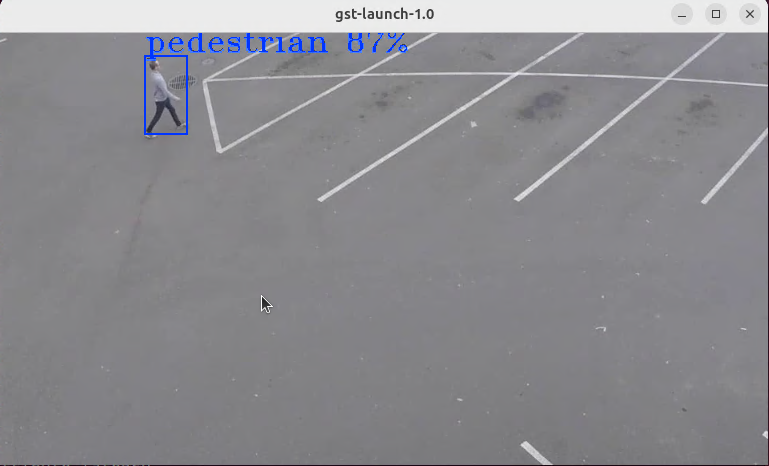

# Getting Started Guide

## Overview

The Metro Vision AI SDK provides a comprehensive development environment for computer vision applications using Intel's optimized tools and frameworks. This guide demonstrates the installation process and provides a practical object detection implementation using DLStreamer and OpenVINO.

## Learning Objectives

Upon completion of this guide, you will be able to:
- Install and configure the Metro Vision AI SDK
- Execute object detection inference on video content
- Understand the basic pipeline architecture for computer vision workflows

## System Requirements

Verify that your development environment meets the following specifications:

- Operating System: Ubuntu 24.04 LTS or Ubuntu 22.04 LTS
- Memory: Minimum 8GB RAM
- Storage: 20GB available disk space
- Network: Active internet connection for package downloads

## Installation Process

Execute the automated installation script to configure the complete development environment:

```bash
curl https://raw.githubusercontent.com/open-edge-platform/edge-ai-suites/refs/heads/main/metro-ai-suite/metro-sdk-manager/scripts/metro-vision-ai-sdk.sh | bash
```


The installation process configures the following components:
- Docker containerization platform
- Intel DLStreamer video analytics framework
- OpenVINO inference optimization toolkit
- Pre-trained model repositories and sample implementations

## Object Detection Implementation

This section demonstrates a complete object detection workflow using the installed components.

### Step 1: Create Working Directory

Create a dedicated working directory for the tutorial:

```bash
mkdir -p ~/metro/metro-vision-get-started-tutorial
cd ~/metro/metro-vision-get-started-tutorial
```

### Step 2: Download Sample Video and model

Download the required video sample and pre-trained model components:

```bash
wget -O sample.mp4 https://github.com/intel-iot-devkit/sample-videos/raw/master/person-bicycle-car-detection.mp4
mkdir -p models/intel/pedestrian-and-vehicle-detector-adas-0001/FP32/
wget -O "models/intel/pedestrian-and-vehicle-detector-adas-0001/FP32/pedestrian-and-vehicle-detector-adas-0001.xml" "https://storage.openvinotoolkit.org/repositories/open_model_zoo/2023.0/models_bin/1/pedestrian-and-vehicle-detector-adas-0001/FP32/pedestrian-and-vehicle-detector-adas-0001.xml?raw=true"
wget -O "models/intel/pedestrian-and-vehicle-detector-adas-0001/FP32/pedestrian-and-vehicle-detector-adas-0001.bin" "https://storage.openvinotoolkit.org/repositories/open_model_zoo/2023.0/models_bin/1/pedestrian-and-vehicle-detector-adas-0001/FP32/pedestrian-and-vehicle-detector-adas-0001.bin?raw=true"
wget -O "models/intel/pedestrian-and-vehicle-detector-adas-0001/pedestrian-and-vehicle-detector-adas-0001.json" "https://raw.githubusercontent.com/dlstreamer/dlstreamer/refs/heads/master/samples/gstreamer/model_proc/intel/pedestrian-and-vehicle-detector-adas-0001.json"
```

### Step 3: Pipeline Execution

Execute the object detection pipeline using the configured assets:

```bash
xhost +
docker run --rm -it \
  -v $PWD:/data \
  -e DISPLAY=$DISPLAY \
  -v /tmp/.X11-unix:/tmp/.X11-unix \
  intel/dlstreamer:latest \
  gst-launch-1.0 filesrc location=/data/sample.mp4 ! \
  decodebin ! videoconvert ! \
  gvadetect model=/data/models/intel/pedestrian-and-vehicle-detector-adas-0001/FP32/pedestrian-and-vehicle-detector-adas-0001.xml model-proc=/data/models/intel/pedestrian-and-vehicle-detector-adas-0001/pedestrian-and-vehicle-detector-adas-0001.json device=CPU ! \
  gvawatermark ! videoconvert ! \
  autovideosink
```



### Pipeline Architecture Analysis

The executed command implements a processing pipeline with the following stages:

1. **File Input**: Reads the specified video file from the filesystem
2. **Video Decoding**: Converts encoded video stream to raw frame data
3. **Object Detection**: Applies the pre-trained model to identify pedestrians and vehicles
4. **Visualization**: Renders bounding boxes and classification labels on detected objects
5. **Display Output**: Presents the annotated video stream through the system display

The resulting output displays the original video content with overlaid detection annotations indicating identified objects and their classification confidence levels.

## Technology Framework Overview

### DLStreamer Framework
DLStreamer provides a comprehensive video analytics framework built on GStreamer technology. Key capabilities include:
- Multi-format video input support (files, network streams, camera devices)
- Real-time inference execution on video frame sequences
- Flexible output rendering and storage options
- Modular pipeline architecture for custom workflow development

### OpenVINO Optimization Toolkit
OpenVINO delivers cross-platform inference optimization for Intel hardware architectures. Core features include:
- Model format standardization through Intermediate Representation (IR)
- Hardware-specific performance optimization
- Extensive pre-trained model repository
- Development tools for model conversion and validation

## Next Steps

Continue your learning journey with these hands-on tutorials:

### [Tutorial 1: OpenVINO Model Benchmark](tutorial-1.md)
Learn to benchmark AI model performance across different Intel hardware (CPU, GPU, NPU) and understand optimization techniques for production deployments.

### [Tutorial 2: Multi-Stream Video Processing](tutorial-2.md) 
Build scalable video analytics solutions by processing multiple video streams simultaneously with hardware acceleration.

### [Tutorial 3: Real-Time Object Detection](tutorial-3.md)
Develop a complete object detection application with interactive controls, performance monitoring, and production-ready features.

### [Tutorial 4: Advanced Video Analytics Pipelines](tutorial-4.md)
Create sophisticated video analytics using Intel® DL Streamer framework, including human pose estimation and multi-model integration.


## Additional Resources

### Technical Documentation
- [DLStreamer](http://docs.openedgeplatform.intel.com/dev/edge-ai-libraries/dl-streamer/index.html) - Comprehensive documentation for Intel's GStreamer-based video analytics framework
- [DLStreamer Pipeline Server](https://docs.openedgeplatform.intel.com/edge-ai-libraries/dlstreamer-pipeline-server/main/user-guide/Overview.html) - RESTful microservice architecture documentation for scalable video analytics deployment
- [OpenVINO](https://docs.openvino.ai/2025/get-started.html) - Complete reference for Intel's cross-platform inference optimization toolkit
- [OpenVINO Model Server](https://docs.openvino.ai/2025/model-server/ovms_what_is_openvino_model_server.html) - Model serving infrastructure documentation for production deployments
- [Edge AI Libraries](https://docs.openedgeplatform.intel.com/dev/ai-libraries.html) - Comprehensive development toolkit documentation and API references
- [Edge AI Suites](https://docs.openedgeplatform.intel.com/dev/ai-suite-metro.html) - Complete application suite documentation with implementation examples

### Support Channels
- [GitHub Issues](https://github.com/open-edge-platform/edge-ai-suites/issues) - Technical issue tracking and community support