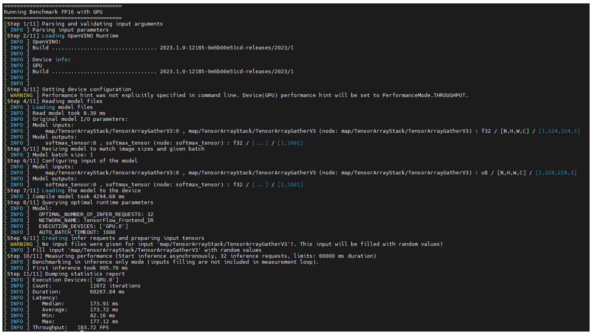

# Tutorial 1: OpenVINO Model Benchmark

This tutorial demonstrates how to download AI models, set up the OpenVINO environment, and run performance benchmarks using Intel's optimized containers. You'll learn to evaluate AI model performance across different hardware configurations including CPU, GPU, and Intel® Core™ Ultra processors.

## Overview

Performance benchmarking is crucial for understanding how AI models will perform in production environments. This tutorial uses the OpenVINO benchmark application to measure inference performance, helping you make informed decisions about hardware selection and model optimization.

## Time to Complete

**Estimated Duration:** 10-15 minutes

## Learning Objectives

Upon completion of this tutorial, you will be able to:

- Download and prepare AI models for benchmarking
- Configure OpenVINO benchmark environment using Docker containers
- Execute performance benchmarks on multiple hardware targets (CPU, GPU, NPU)
- Interpret benchmark results and performance metrics
- Understand the impact of different hardware configurations on AI inference

## Prerequisites

Before starting this tutorial, ensure you have:

- Metro Vision AI SDK installed and configured
- Docker installed and running on your system
- Basic familiarity with command-line operations
- Internet connection for downloading models and containers

## System Requirements

- **Operating System:** Ubuntu 22.04 LTS or Ubuntu 24.04 LTS
- **Memory:** Minimum 8GB RAM
- **Storage:** 5GB free disk space
- **Network:** Active internet connection

## Tutorial Steps

### Step 1: Create Working Directory and Download Assets

First, create a dedicated workspace and download the required video sample and AI model:

```bash
# Create working directory
mkdir -p ~/metro/metro-vision-tutorial-1
cd ~/metro/metro-vision-tutorial-1

# Download sample video for benchmarking
wget -O bottle-detection.mp4 https://storage.openvinotoolkit.org/test_data/videos/bottle-detection.mp4
```

### Step 2: Download Pre-trained Model

Download the YOLOv10s model using the DLStreamer container:

```bash
# Download YOLOv10s model using DLStreamer
docker run --rm --user=root \
  -e http_proxy -e https_proxy -e no_proxy \
  -v "${PWD}:/home/dlstreamer/" \
  intel/dlstreamer:2025.1.2-ubuntu24 \
  bash -c "export MODELS_PATH=/home/dlstreamer && /opt/intel/dlstreamer/samples/download_public_models.sh yolov10s"
```

This command will:
- Download the YOLOv10s object detection model
- Convert it to OpenVINO IR format (FP16 precision)
- Store the model files in the `public/yolov10s/FP16/` directory

### Step 3: Run Benchmark on CPU

Execute the OpenVINO benchmark application to measure inference performance on CPU:

```bash
docker run -it --rm \
  --volume ${PWD}:/home/openvino \
  --env http_proxy=$http_proxy \
  --env https_proxy=$https_proxy \
  --env no_proxy=$no_proxy \
  openvino/ubuntu24_dev:2025.3.0 \
  /opt/intel/openvino_2025.3.0.0/samples/cpp/samples_bin/benchmark_app \
  -m /home/openvino/public/yolov10s/FP16/yolov10s.xml \
  -i /home/openvino/bottle-detection.mp4 \
  -d CPU
```



### Step 4: Run Benchmark on GPU (Optional)

If your system has Intel integrated graphics, run the benchmark on GPU for comparison:

```bash
docker run -it --rm \
  --volume ${PWD}:/home/openvino \
  --device /dev/dri:/dev/dri \
  --device-cgroup-rule='c 189:* rmw' \
  --env http_proxy=$http_proxy \
  --env https_proxy=$https_proxy \
  --env no_proxy=$no_proxy \
  openvino/ubuntu24_dev:2025.3.0 \
  /opt/intel/openvino_2025.3.0.0/samples/cpp/samples_bin/benchmark_app \
  -m /home/openvino/public/yolov10s/FP16/yolov10s.xml \
  -i /home/openvino/bottle-detection.mp4 \
  -d GPU
```

### Step 5: Run Benchmark on NPU (Intel® Core™ Ultra Processors)

For systems with Intel® Core™ Ultra processors, benchmark the Neural Processing Unit (NPU):

```bash
docker run -it --rm \
  --volume ${PWD}:/home/openvino \
  --device=/dev/accel \
  --env http_proxy=$http_proxy \
  --env https_proxy=$https_proxy \
  --env no_proxy=$no_proxy \
  openvino/ubuntu24_dev:2025.3.0 \
  /opt/intel/openvino_2025.3.0.0/samples/cpp/samples_bin/benchmark_app \
  -m /home/openvino/public/yolov10s/FP16/yolov10s.xml \
  -i /home/openvino/bottle-detection.mp4 \
  -d NPU
```