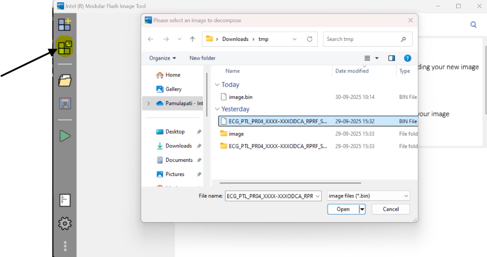
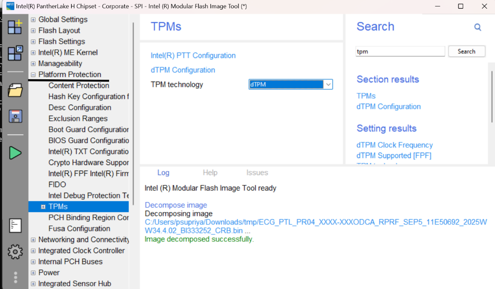
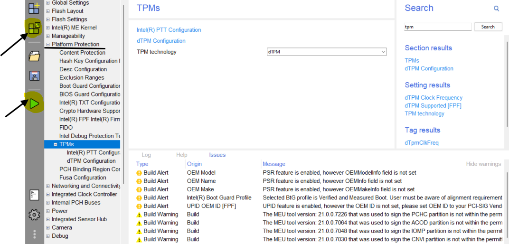
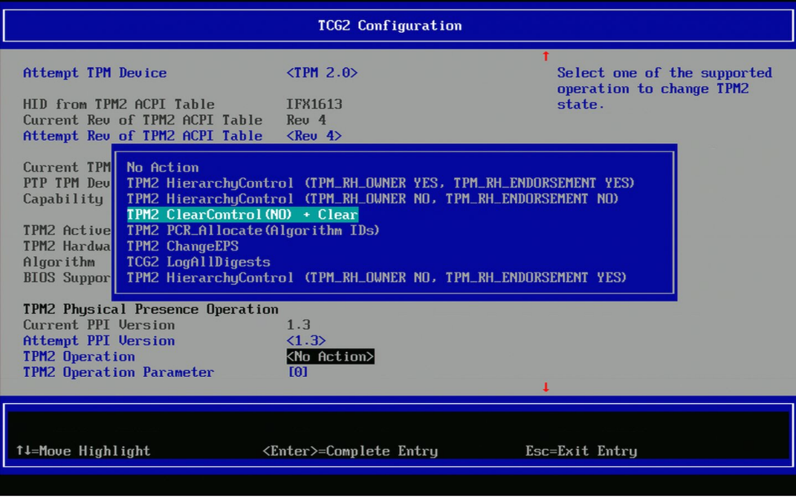
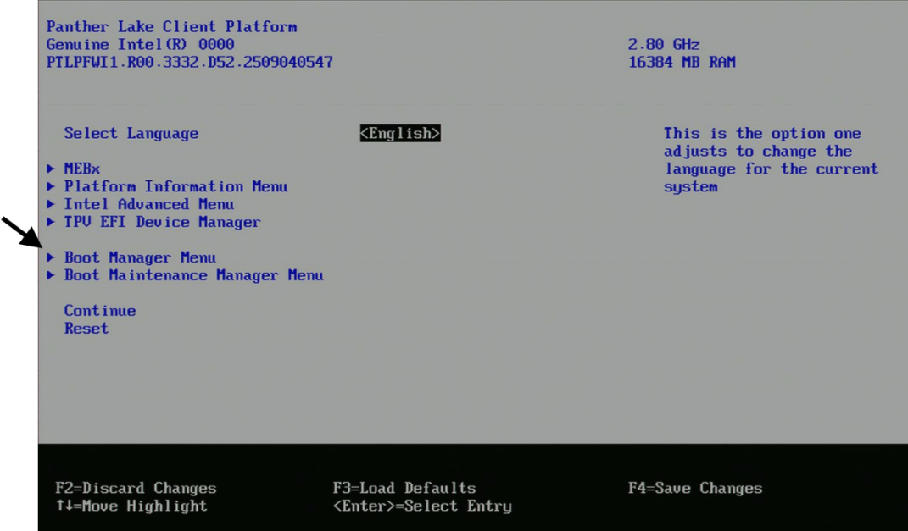
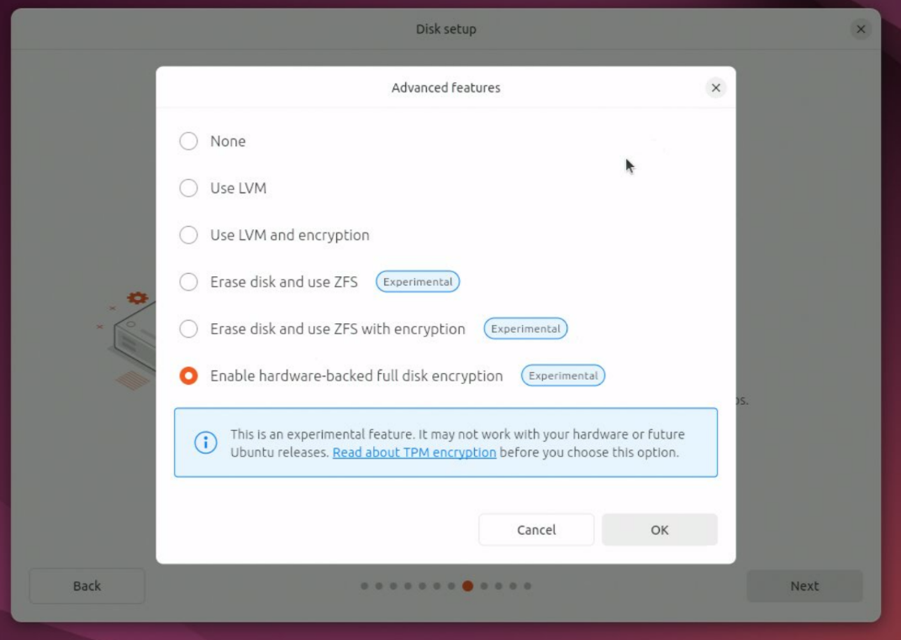
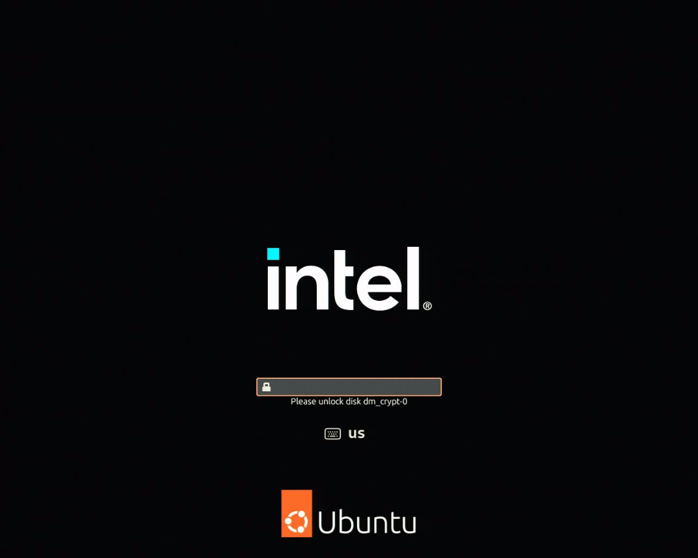
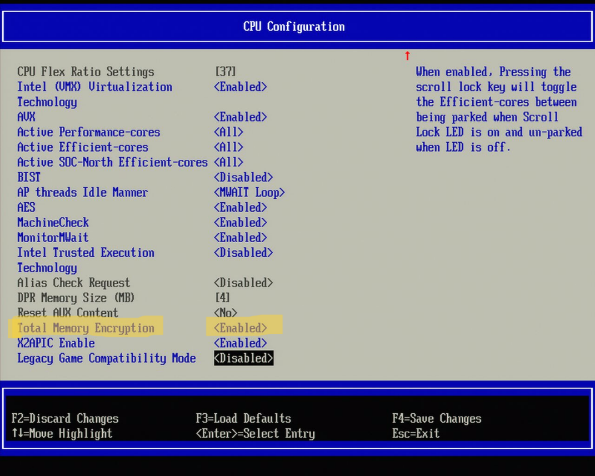

# Security Enablement

This guide covers security enablement for the Smart Intersection application, including:
- dTPM (Discrete Trusted Platform Module)
- FDE (Full Disk Encryption) 
- UEFI Secure Boot
- TME (Total Memory Encryption)

These security features protect the Smart Intersection system from unauthorized access and ensure data integrity for traffic monitoring and analysis.

## 1. Enabling dTPM for Smart Intersection Security

**Prerequisites**: 
- dTPM module must be physically connected to the PTL Board
- Recommended: Infineon TPM (Xenon_4.1.0) for optimal Smart Intersection compatibility

**Step 1: Download Required Components**

 Download IFWI Firmware

- Navigate
  to: <https://www.intel.com/content/www/us/en/secure/content-details/858133/panther-lake-h-for-edge-platforms-uefi-reference-bios-ifwi-3214-54-alpha-and-3332-52-er-pre-beta.html?wapkw=ifwi&DocID=858133>

    - Download the IFWI file
    - You need to sign in to intel.com to get the access.
    - Extract the zip file.
    - Locate the binary file(*.bin) file according to your platform (e.g., `858133_ptl-h-refbios_releasepackage\858133_ptl-h-refbios3332_52releasepackage\IFWI\CRB\ECG_PTL_PR04_XXXX-XXXODCA_RPRF_SEP5_11E50692_2025WW34.4.02_BI333252_CRB.bin`)

- Navigate
  to: <https://www.intel.com/content/www/us/en/secure/design/confidential/software-kits/kit-details.html?kitId=866974&wapkw=%20Consumer%20and%20Corporate%20Production>
    - Download "Intel_CSME_SW_PTL_2540.8.40.0_Consumer_Corporate.zip" under "Intel_CSME_SW_PTL_2540.8.40.0_Consumer_Corporate"
    - Extract the downloaded zip file
    - "mfi.exe" will be located under "Intel_Silicon_FW_Kit_PTL-H12Xe_ES1_ES2_2025WW41.2.02\Tools\System_Tools\MFIT\Windows64"

**Step 2: Configure IFWI with dTPM Support**

1. **Launch MFIT Tool**: Execute `mfit.exe` and wait for the application to fully load.

2. **Decompose Original IFWI**: 
   - Click the **"Decompose Image"** button
   - Select the downloaded IFWI file from the extracted directory
   - Wait for the decomposition process to complete
modul



3. **Enable dTPM Configuration & Build Image**:
   - Navigate to **"Platform Protection Features"** section
   - Locate **"TPM Technologies"** subsection
   - From the available TPM options, select **"dTPM"**
   - Click **"Build Image"** to generate the new firmware image
   - The tool will create a new IFWI file named `image.bin` in the same directory
   - Verify the `image.bin` file has been successfully created



**Step 3: Flash the Modified IFWI**

> **Important**: Power OFF the PTL board before flashing

1. **Prepare Flashing Environment**:
   - Ensure the PTL board is properly connected to the flashing hardware
   - Verify DediProg or TTK3 is correctly configured and recognized

2. **Flash the New IFWI**:
   - Using your preferred flashing tool (DediProg or TTK3), load the newly generated `image.bin` file
   - Initiate the flashing process
   - Monitor the flashing progress for any errors
   - Power cycle the PTL board after successful flashing

3. **Verify dTPM Functionality**:
   - Check that dTPM functionality is enabled in the system BIOS/UEFI
   - Confirm dTPM is properly detected by the operating system

## 2. Enabling UEFI Secure Boot for Smart Intersection

UEFI Secure Boot establishes a chain of trust from firmware to OS, cryptographically verifying the signature and hash of all boot components before passing control to the operating system. This ensures the Smart Intersection application runs on a verified, secure platform.

Ubuntu LTS official releases are signed by Canonical, and Canonical's certificate is pre-enrolled in the MOK (Machine Owner Key) database.

**Step 1: Install Required Tools**

```bash
sudo apt update
sudo apt upgrade
sudo apt-get install -y openssl mokutil sbsigntool
```

**Step 2: Verify Kernel Signature**

```bash
sudo sbverify --list /boot/vmlinuz-<kernel_version>-generic
```

**Step 3: Verify Certificate Enrollment**

```bash
mokutil --list-enrolled
```


**Step 4: Install Signed Shim Binary**

Most UEFI firmware has Microsoft keys enrolled by default. To verify GRUB and Linux kernel signed by Canonical, install the signed shim binary. Shim is a small bootloader signed by Microsoft that bridges the gap between firmware and Linux GRUB, maintaining the chain of trust.

```bash
sudo apt-get install sbsigntool openssl grub-efi-amd64-signed shim-signed
sudo grub-install --uefi-secure-boot
```

**Step 5: Configure Secure Boot**

1. Reboot the platform and enter the UEFI GUI menu
2. Verify that Secure Boot is initially disabled
3. Confirm the shim binary can boot to OS

**Step 6: Enroll Microsoft Certificates**

1. Get the Secure Boot Microsoft keys and certificates:
```bash
git clone https://git.launchpad.net/qa-regression-testing
```

2. Enroll the certificates (type 'y' when prompted):
```bash
cd qa-regression-testing/notes_testing/secure-boot
cp -rf * /tmp
sudo /tmp/sb-setup enroll microsoft
```

> **Note**: If enrollment errors occur, reboot the platform, boot using `fs0:/efi/ubuntu/shimx64.efi`, and rerun the enroll command.

**Step 7: Enable and Verify Secure Boot**

1. Reboot the platform and enter the BIOS menu
2. Verify that Secure Boot is now enabled
3. Boot using `fs0:/efi/ubuntu/shimx64.efi`
4. Check the Secure Boot status after booting to Ubuntu:

```bash
mokutil --sb-state
```


### TPM Clear Operation

TPM clear removes all stored keys, certificates, and ownership data from the Trusted Platform Module, resetting it to factory defaults. This is useful when setting up security for a new Smart Intersection deployment.

1. Enter the boot manager menu
2. Choose the TCG2 configuration 
3. Clear the TPM



## 3. Ubuntu Installation with Full Disk Encryption

Full Disk Encryption (FDE) protects Smart Intersection application data and configurations by encrypting the entire disk. This ensures that sensitive traffic analysis data and system configurations remain secure even if the hardware is compromised.

Once FDE is enabled, the encrypted disk can only be accessed with the security key configured during installation.

**Step 1: Prepare Ubuntu Installation Media**

1. Download the official Ubuntu 24.04.2 LTS release from the Ubuntu website
2. Create a bootable Ubuntu USB drive
3. Enter the boot manager menu and select the bootable USB with Ubuntu 24.04.2



**Step 2: Begin Ubuntu Installation**

Boot from the bootable USB and select "Try or Install Ubuntu".

**Step 3: Configure Basic Settings**

Configure language, accessibility options, keyboard layout, and other basic settings. Optionally connect to wired internet if available.

**Step 4: Select Installation Type**

Select "Install Ubuntu" option.

**Step 5: Choose Installation Mode**

Select "Interactive Installation" for full control over security settings.

**Step 6: Configure Applications**

In the Applications page, select "Default selection". If you made a wired connection earlier, select both checkboxes.

**Step 7: Enable Disk Encryption**

In the Disk setup page:
1. Select "Erase disk and install Ubuntu"
2. Click the "Advanced features" button to access encryption options

**Step 8: Choose Encryption Method**

There are two FDE methods available. Choose based on your Smart Intersection security requirements:

**Method 1: Software-based Encryption**
- Select **"Use LVM and encryption"**
- This encrypts your entire drive using LVM
- Requires a strong passphrase that you'll enter at boot time to decrypt and access your system

**Method 2: Hardware-backed Full Disk Encryption** 
- Uses dedicated security chips (TPM or Secure Enclave) to store encryption keys
- Provides stronger protection than software-only encryption
- **Note**: To enable this option, you must first enable Secure Boot in BIOS/UEFI settings and clear/reset the TPM module



If Hardware-backed full disk encryption is enabled, you can skip Steps 9 and 12 as the TPM chip will automatically handle key management and drive decryption.

**TPM Recovery Key**: Use the following command to show TPM recovery keys:
```bash
sudo snap recovery --show-keys
```


**Step 9: Create Security Key** (Software-based Encryption Only)

Create a **Security Key** that will be required to decrypt the Ubuntu drive before accessing the Smart Intersection application.

**Step 10: Complete Installation Configuration**

Complete the installation by configuring:
- Username and password
- Timezone settings
- Review your choices before proceeding

**Step 11: Finalize Installation**

1. Complete the installation process
2. Restart the PC when prompted
3. Remove the bootable drive when instructed after restart

**Step 12: First Boot with Encryption** (Software-based Encryption Only)

1. Enter your **Security Key** from Step 9 as the encryption password to unlock the disk
2. The Ubuntu login screen will appear
3. Ubuntu installation with FDE is now completed and ready for Smart Intersection deployment

## 4. TME (Total Memory Encryption) Enablement

Intel TME encrypts the computer's entire memory with a single transient key. All memory data passing to and from the CPU is encrypted, including sensitive Smart Intersection data such as traffic analysis algorithms, detection models, credentials, encryption keys, and other proprietary information.



**Step 1: Check TME Support**

First, verify if TME is supported on the Intel platform. Read bits 35:32 of MSR 0x981. If this value is non-zero, TME is supported.


**Step 2: Enable TME in BIOS**

1. Enter BIOS menu by pressing 'F2' while booting the platform
2. Navigate to: **Intel Advanced Menu → CPU Configuration → Total Memory Encryption**
3. Set to **Enabled**
4. Save changes (F4) and reboot



**Step 3: Verify TME Enablement**

Check if TME is enabled by reading bit 1 of MSR 0x982. If TME is enabled, the value returned will be 1 as shown.


**Step 4: Alternative Verification Using Kernel Logs**

You can also use the `dmesg` kernel log to check TME enablement status:

```bash
dmesg | grep -i tme
```


## Summary

With these security features enabled, your Smart Intersection application will benefit from:

- **dTPM**: Hardware-based cryptographic operations and secure key storage
- **UEFI Secure Boot**: Verified boot chain ensuring system integrity 
- **Full Disk Encryption**: Protection of traffic analysis data and system configurations
- **Total Memory Encryption**: Runtime protection of sensitive algorithms and detection models

This comprehensive security implementation ensures that your Smart Intersection system can safely process traffic data, store sensitive configurations, and operate in trusted environments.
